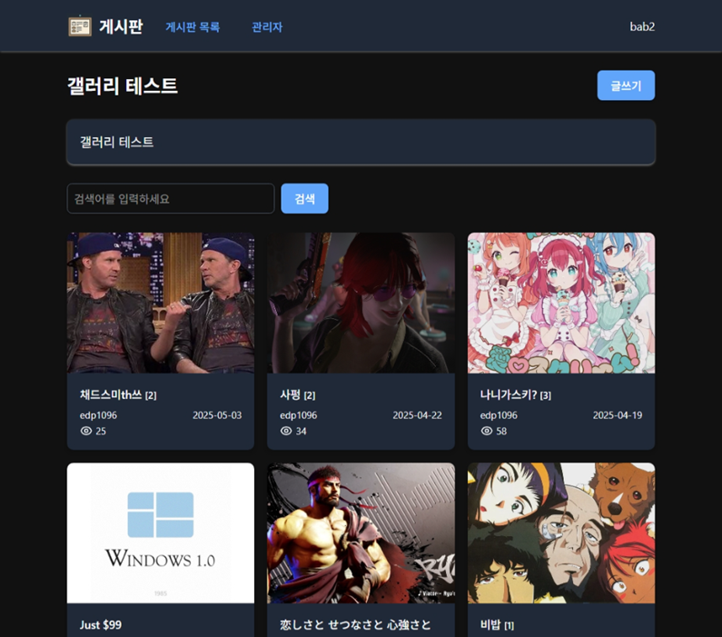

간단한 회원관리와 게시판

예시: https://bbs.enjoytools.net


## 기능, 특징

* Golang 단일 파일
* DB - mysql, postgresql, sqlite3
* 브라우저 설정에 맞춘 자동 다크모드
* 아이디, 비밀번호, 이름(닉네임), 이메일로 회원가입/로그인
* 메뉴 - 카테고리 할당을 이용한 최대 2단계 메뉴화
* 게시판 게시물/댓글 작성/수정/삭제 - 목록형, 갤러리형 게시물 리스팅
* 페이지
* 에디터 - prosemirror 자체 제작
    * 영상/음악 삽입: 유튜브, 비미오, 데일리모션, 니코니코동화, 치지직클립, 틱톡, 비리비리(.com 만), 사운드클라우드, 노노키, 믹스클라우드
    * 이미지삽입: 업로드, URL
* 템플릿(html, js, css) 내보내기, 사용자정의
* 데이터 이전
    * DB간 스키마/데이터 이전
    * 제로보드XE 1.8.x ~ 1.11.x - 회원정보를 제외한 게시물과 댓글, 첨부파일만


## 실행

* 처음
```sh
go-board export-env
mv .env.example .env
migrate
go-board
```

* 나중
```sh
go-board
```


## 설정

* `.env` 파일 수정 - [.env.example](docs/env_samples/.env.example) 참고
* 환경변수(도커, 쿠버네티스) - [setenv.sh](docs/env_samples/setenv.sh)를 참고
* 리버스프록시 - [REVERSE_PROXY.md](docs/REVERSE_PROXY.md) 참고


## 마이그레이션

* 이기종 DB 마이그레이션 - [MIGRATION.md](docs/MIGRATION.md)
* 제로보드XE - [MIGRATION_XE.md](docs/MIGRATION_XE.md)


## 템플릿

* 아래 명령 실행 후, `web` 폴더 수정
```sh
go-board export-web
```


## 도움말

```sh
go-board -h
migrate -h
```


## 빌드

* 요구사항
    * Go >= 1.24
    * PostgreSQL >= 13 / MariaDB >= 10.6 / SQLite 3.x
    * tailwindcss >= 4.1
    * yarn classic

* 처음
```sh
yarn
make
```

* 나중
```sh
make
```


----

ai 써서 만들었습니다.

`클로드 프로`를 사용했고, 참고용으로 대화내역을 `docs/claude`폴더에 올려두었습니다.

`goose` 마이그레이션 모듈과 `tailwindcss`는 사전지식 없이 그리고 `alpine.js`도 ai의 제안을 거의 그대로 반영했습니다.

ai에게 갑질은 최대한 지양하려 노력했지만 보면서 불편을 끼치는 어구가 있다면 양해 부탁드립니다.

누군가에게는 도움이 되길 바랍니다.
